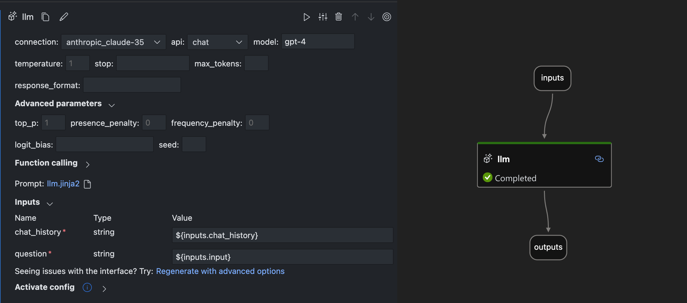
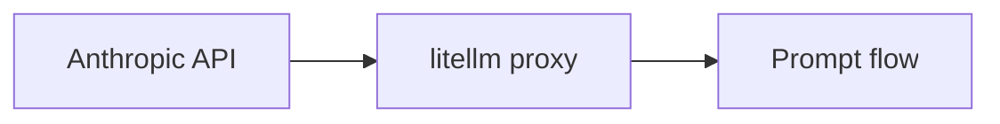
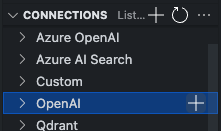
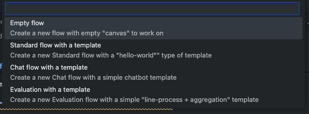

# Using Prompt Flow with Anthropic Model

<p align="center">
    
</p>

## Description

Prompt flow merupakan salah satu framework untuk pengembangan AI/LLM. Fitur yang dimiliki Prompt Flow cukup banyak, dari mulai visualisasi graph DAG sampai built-in tracing. Namun untuk built-in support dari LLM yang digunakan saat masih terbatas pada Azure OpenAI dan OpenAI. Namun perkembangan model LLM yang sangat pesat membuat developer yang menggunakan Prompt Flow ingin menggunakan model lain di luar built-in support. Sambil menunggu fitur built-in di dalam project Prompt Flow, berikut adalah salah satu workaround untuk menggunakan prompt flow dan model dari anthropic untuk proses development aplikasi AI.

## Pre-Requisite

1. Anthropic API key
2. Prompt Flow VS Code Extension
3. Install package yang dibutuhkan

```bash
conda create -n pflitellm python=3.10
conda activate pflitellm
pip install litellm 'litellm[proxy]' promptflow promptflow-core promptflow-tools
```

## Step by Step



### 1. Setup `litellm` Proxy Server

Untuk menjalankan `litellm` sebagai proxy dengan konfigurasi custom, buat file `config.yaml` dengan parameter seperti di bawah ini:

```yaml
model_list: 
  - model_name: gpt-4 # nama model yang ada di dalam list node openAI di prompt flow
    litellm_params: # all params accepted by litellm.completion() - https://docs.litellm.ai/docs/completion/input
      model: claude-3-5-sonnet-20241022
      api_key: "os.environ/ANTHROPIC_API_KEY"
      drop_params: true # memastikan kompatibilitas dengan API request dari Anthropic
```

Sebelum menjalankan proxy server, export API key Anthropic ke environment variable dengan command berikut

```bash
export ANTHROPIC_API_KEY=my-api-key
```

Kemudian jalankan proxy server

```bash
litellm --config config.yaml
```

### 2. Buat Connection OpenAI di Prompt flow

Buat connection baru di bagian tab **Connections** dengan klik tanda **+**

</br>

Kemudian akan memunculkan halaman settingan file yaml baru, isi file yaml tersebut dengan:

```yaml
$schema: https://azuremlschemas.azureedge.net/promptflow/latest/OpenAIConnection.schema.json
name: "anthropic_claude-35"
type: open_ai
api_key: "<no-change>" # Use'<no-change>' to keep original value or '<user-input>' to update it when the application runs.
organization: ""
base_url: "http://0.0.0.0:4000"
```

Pastikan port dan alamat localhost sama dengan `litellm` proxy server. Kemudian klik bagian `create connection`. Ini akan membuat kotak untuk input api key

> **Note:** Pada tahap ini, **API key** yang dimasukkan ke dalam Prompt flow **bisa apa saja**, karena autentikasi dengan Anthropic API ada di `litellm`.

### 3. Buat Simple Flow untuk Test LLM

Di tab **Flows** klik lambang **+** dan pilih **Empty Flow**.

</br>

Kemudian buat node LLM dengan pilihan model yang sama dengan file `config.yaml`, dalam contoh ini menggunakan `gpt-4`.
